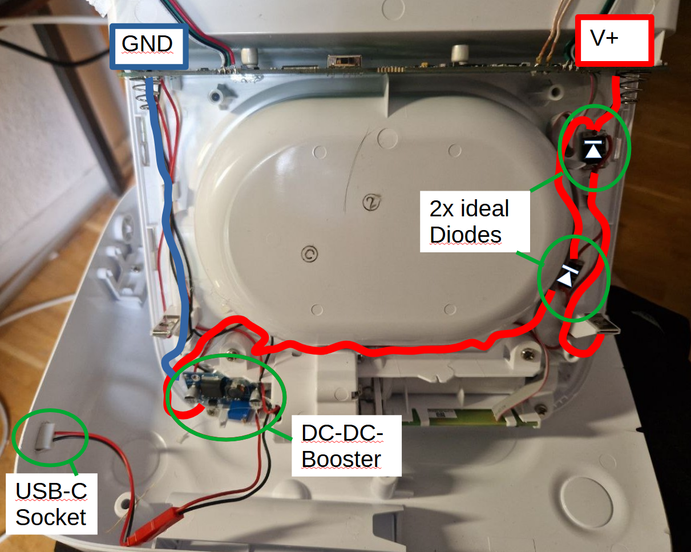

# SureFeed-USB-Power-Mod
A modification to run the SureFeed Pet Feeder off a (5V) USB Wall Plug using a step-up boost converter and automatic power switching. 
It allows safe fallback to battery operation when USB power is lost.

## ⚠️ UPDATE (29.11.2025)
> The mod is fixed. Short: The output voltage of the DC-DC-Booster needs to be set to around 5.9-6.0 Volts. Before, I had it set to 6.4 Volts (which caused the issue) and because the motor opened and > closed the door a little faster (which I liked). My theory is that a voltage too high detunes the RFID receiver (or causes some overdrive / saturation / regulator stress). 

~~> I noticed an issue with the mod: When the Surefeed is powered externally, the feeder does not open, when a pet-chip is near the antenna.~~
~~> My suspect is the switching noise of the voltage-boost-module interfering with the antenna. It worked fine, when I installed the boost-module inside the battery compartment. So repositioning of the boost module might be an option. Another option would be to add shielding to the area around the boost-module.~~
>
~~> I checked the voltage going into the mainboard with an oscilloscope and voltage ripples should be no issue. As I mentioned before: The mod worked, when the Boost-module was installed inside the battery compartment.~~

## ⚠️ Disclaimer

> ⚠️ **Warning**  
> This modification involves working with electronic components and power circuits. Proceed at your own risk.
>
> - This procedure will **void the warranty** of your SureFeed pet feeder.  
> - Incorrect wiring or component failure can result in **damage to the feeder**, **USB power sources**, or **other connected devices**.  
> - There is a potential risk of **injury**, **burns**, or **fire** if the components are misused or improperly insulated.  
> - Therefore, this project is intended for **educational and experimental purposes only**.
>
> The author assumes **no responsibility** for any damage, malfunction, or harm resulting from the use or misuse of this guide.

## 🔧 Components Used

- USB-C jack (breakout)
- XL6009 boost converter (set to ~~6.4V~~ 5.9-6.0 V)
- 2x XL74610 ideal diode modules
- Wires, solder, drills/cutter, multimeter, hot glue gun, optional: JST-RCY wire-to-wire connector.
- 5V (2A) Power supply with USB-C-connector. 1.5 A might work, but is not recommended.
- (optional: Ultrasonic cutter to cut the plastic)

## ⚙️ Circuit Summary

Power input comes either from a USB-C source (5V boosted to ~~6.4V~~ 5.9-6.0V) or the original 4x C battery pack. The two sources are fed through separate ideal diode modules and joined at the feeder's power input terminal.
The ideal diode modules allow switching of the power sources (either USB-C or Battery), should one of the sources fail. Also, it provides protection against unwanted flow of current in the wrong direction. 

## 📝 Build Instructions

1. Remove the four Philips screws on the bottom of the feeder. Open the feeder and locate power input terminals. 
2. A possible spot for the negative terminal (or ground/GND) connection is the solder connection of the battery contact spring next to the TPGND pad. You need to lift the mainboard a little to reach the spot. Solder a black wire there. and run it down to the area next to the motor.
3. For the positive connection, locate the red wire (on the opposite side of the mainboard. Make sure it is the correct side, or you will cause damage to the Mainboard) next to the ribbon connector and cut it a few centimeters after the mainboard.    
4. Solder the red wire from the mainboard to the cathode (+, pointy side of the arrow) side of one of the ideal diode modules. The arrow on the modules should point towards the mainboard.
5. Solder the red wire from the Battery connector to the other end of the ideal diode module (back side of the arrow, anode/-).
6. Cut a few centimeters of (red) wire and connect both cathode (+/pointy side of the arrow) terminals of the two ideal diode modules together.
7. Install 4 Batteries. Check the voltage between ground and the cathode of the diode modules. It should be ~~~6V or a little more~~ maximum 6.0V. If it is around 3V, there is a critical error in the wiring. If it is ok, remove the batteries and continue.
8. Cut a slot for the USB-C-jack into the shell of the pet feeder (see pictures for the approximate location). A  Install the USB-C Jack. Optional: A JST-RCY connector is nice between the USB-C-Jack and the DC-Booster.
9. Connect USB-C-jack to the DC-Booster input. Connect only the ground wire to the DC-Booster. Do not connect the DC-Booster to the red wire of the Pet-Feeder, yet.
10. Connect a USB-C cable/charger. Adjust the DC-Booster to output ~+5V (check with multimeter between ground and the positive output terminal of the DC-Booster) We will increase the voltage later. Disconnect the Charger.
11. Connect the red wire from the pet feeder to the DC-Booster. Connect the Charger and set the voltage of the DC-Booster, so the voltage between ground and the cathode of the diode modules is around ~~6.4~~ 5.9-6.0 volts.
12. You can secure the modules and the wires with hot glue to the pet feeder. The components on the modules need to dissipate heat so they should face away from the surface. The back sides are usually free so you can add a drop of hot glue there.
13. Install the bottom of the feeder and install batteries.
14. Test the device.

## 📷 Photos

See [images/](images/) for wiring details and installation photos.

## ⚠️ Notes

The feeder draws <1A ~~@6.4~~ 5.9-6.0 Volts when operating the motor; Use at least a 5 V 2 Amp Power supply for enough headroom. Make sure, that your power supply can provide enough current.
